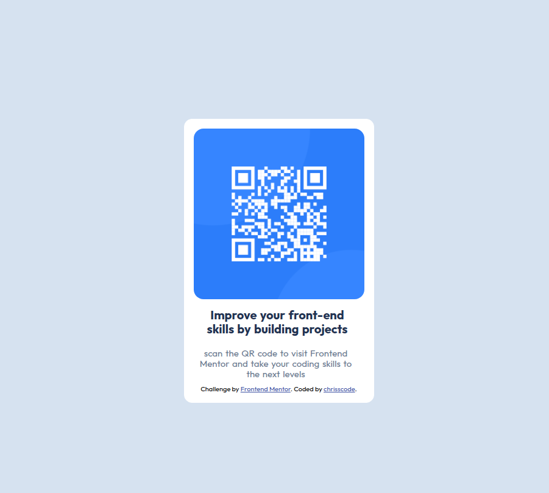

## 📱 Frontend Mentor - QR Code component 

This is my solution to the QR Code Component challenge from Frontend Mentor.

I built this project using HTML and CSS, focusing on semantic HTML, Flexbox, responsive layout and styling according to challenge requirements. 🚀

## 🧱 See Finished Result 

## 📑 See More Content

- [live site] (https://qrbyalex.netlify.app)
- [Frontend Mentor challenge] (https://www.frontendmentor.io/challenges/qr-code-component-iux_sIO_H)

## 🛠️ Built with
- 🏗️ Semantic HTML markup
- 🎨 CSS3
- 📦 Flexbox

## 🧠 What I learned

While building this project, I practiced using Flexbox to center the component horizontally and vertically .

I also learned how to create responsive layouts using CSS media queries and how to structure HTML using semantic elements.✨
 
## 💪 Challenges

One of the challenges I faced was making the component stay centered and responsive on different screen sizes.

I solved this using Flexbox and adjusting the layout with CSS.

## 🚀 Future Improvements

I would like to improve my understanding of responsive spacing and typography in future projects and practice more and more.

## 🧑‍💻 Author
- Frontend Mentor - [@Alex Christopher](https://www.frontendmentor.io/profile/Chrisscode360tz)
